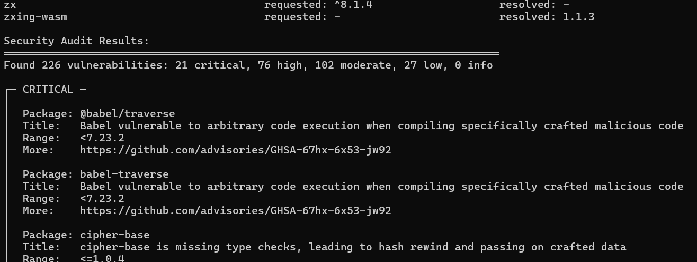

# npminspect

*Note: This tool is created in assistance with gpt-5, use with caution as this is still work in progress*

Traverse a directory tree to discover npm dependencies from `package.json` and common lockfiles. Outputs either a compact table or JSON inventory with requested ranges, resolved versions, and file occurrences.

## Install

- Prerequisites: Rust (stable)
- Build from source:
  - `cargo build --release`
  - Binary: `target/release/npminspect`

## Usage

`npminspect [OPTIONS] [PATH]`

fe.
```sh
npminspect --audit --no-gitignore --follow-symlinks --format json -o report.json
```
_Note that the audit is best to run in single project, if ran in a folder with multiple projects it might take a while to complete to scan every project with bulk audit. Audit is can only find packages that are listed to be vulnerable in npm registry_
- `PATH`: root directory to scan (defaults to `.`)

### Options

- `--format <table|json|tree|paths>`: Output format (default: `table`).
  - `table`: Flat list of packages with requested/resolved versions.
  - `json`: Machine-readable JSON output.
  - `tree`: Colored dependency tree with vulnerability indicators.
  - `paths`: Show only dependency paths to vulnerable packages.
- `--depth <N>`: Maximum depth for tree output (default: `3`).
- `--include-non-runtime <true|false>`: Include `dev/peer/optional` deps from `package.json` (default: `true`). Set to `false` to include only runtime `dependencies`.
- `--no-gitignore`: Do not respect `.gitignore` files.
- `--follow-symlinks`: Follow symlinks while walking.
- `-o, --output <FILE>`: Write output to a file. Use `-` for stdout.
- `-i, --include <REGEX>`: Keep only packages matching any of these regex patterns (repeatable).
- `-x, --exclude <REGEX>`: Exclude packages matching any of these regex patterns (repeatable).
- `--audit`: Check for security vulnerabilities using the npm registry's Bulk Advisory API.
- `-h, --help`: Show help.
- `-V, --version`: Show version.

### Examples

- Table to stdout:
  - `npminspect`
- JSON to stdout:
  - `npminspect --format json -o -`
- Table to file:
  - `npminspect --format table -o deps.txt`
- JSON, runtime-only `package.json` deps, include only react packages:
  - `npminspect --include-non-runtime=false -i '^@?react($|/)' --format json -o -`
- Include react but exclude react-dom:
  - `npminspect -i '^react$' -x '^react-dom$' --format json -o deps.json`
- Exclude all `@types/*`:
  - `npminspect -x '^@types/'`
- Scan and check for vulnerabilities:
  - `npminspect --audit`
- Audit with JSON output:
  - `npminspect --audit --format json -o audit-report.json`
- Colored dependency tree with vulnerabilities highlighted:
  - `npminspect --format tree`
- Deeper tree view (5 levels):
  - `npminspect --format tree --depth 5`
- Show only paths to vulnerable packages:
  - `npminspect --format paths`

## Output

### Table

Human-readable summary with requested ranges (from `package.json` when present) and resolved versions (from lockfiles when present):

```
Packages found:
──────────────────────────────────────────────────────────────────────────────
<name>                             requested: <ranges>             resolved: <versions>
```

Includes a section listing non-fatal parse errors at the end, if any.

### JSON

Stable machine-readable structure:

```json
{
  "packages": {
    "<name>": {
      "resolved_versions": ["1.2.3", "2.0.0"],
      "requested_ranges": ["^1.2.0"],
      "occurrences": [
        {"source_file": "path/package.json", "source_kind": "package_json", "spec": "^1.2.0"},
        {"source_file": "path/package-lock.json", "source_kind": "package_lock", "spec": "1.2.3"}
      ]
    }
  },
  "errors": [
    {"file": "path/to/file", "message": "explanation"}
  ],
  "audit": {
    "advisories": {
      "<name>": [
        {"id": 1234, "title": "Vulnerability title", "severity": "high", "url": "https://...", "name": "<name>", "vulnerable_versions": "<1.2.4"}
      ]
    },
    "summary": {"critical": 0, "high": 1, "moderate": 0, "low": 0, "info": 0, "total": 1}
  }
}
```

Note: The `audit` field is only present when `--audit` is used.

### Tree

Dependency tree showing the full dependency hierarchy. Vulnerable packages are highlighted with colored indicators:

```
myproject
├── lodash@4.17.15
├── axios@0.21.0
│   ├── follow-redirects@1.14.0
│   └── ● is-buffer@2.0.0          ← vulnerable (moderate)
└── express@4.17.1
    ├── accepts@1.3.7
    └── ● body-parser@1.19.0       ← vulnerable (high)
        └── ...

Vulnerability Legend:
  ● = critical (bright red)
  ● = high (red)
  ● = moderate (yellow)
  ● = low (blue)
```

Use `--depth N` to control how deep the tree renders (default: 3).

### Paths

Shows only the dependency chains that lead to vulnerable packages, making it easy to identify which direct dependency is responsible:

```
Dependency paths to vulnerable packages:

● is-buffer [MODERATE]
   → axios@0.21.0
   └─ is-buffer@2.0.0

● body-parser [HIGH]
   → express@4.17.1
   └─ body-parser@1.19.0
```

This format automatically runs `--audit` to find vulnerabilities.

## Security Audit

When `--audit` is specified, npminspect queries the npm Registry's [Bulk Advisory API](https://docs.npmjs.com/cli/v10/commands/npm-audit) to check for known vulnerabilities in your resolved package versions.

### How It Works

1. Collects all resolved versions from lockfiles (package-lock.json, yarn.lock, pnpm-lock.yaml).
2. Sends a single bulk request to the npm registry with all package/version pairs.
3. Receives and displays any matching security advisories.

### Table Output (with `--audit`)

Security Audit Results:



Vulnerabilities are grouped by severity (critical → info) for easy prioritization.

### Requirements

- Requires network access to `registry.npmjs.org`.
- Only works with resolved versions from lockfiles; `package.json` ranges alone cannot be audited.
- If no lockfile is present, a warning is shown and the audit is skipped.

## What it Parses

- `package.json`: `dependencies` and, optionally, `devDependencies`, `peerDependencies`, `optionalDependencies` (controlled by `--include-non-runtime`).
- `package-lock.json` (npm v1 and v2+): extracts resolved versions.
- `npm-shrinkwrap.json`: treated like `package-lock.json`.
- `yarn.lock` (classic v1): best-effort extraction of resolved versions.
- `pnpm-lock.yaml`: extracts names/versions from `packages` keys like `/name@1.2.3`.

Notes:
- Yarn Berry (v2+) lockfiles are not parsed.
- Parsers are best-effort; unreadable files are reported under `errors` without failing the run.

## Filtering

- `-i/--include REGEX`: only include package names matching any of these.
- `-x/--exclude REGEX`: remove package names matching any of these.
- If both are provided, includes are applied first (allowlist), then excludes.

Invalid regex patterns fall back to a literal match of the provided string.

## Performance & Walking

- Uses `ignore` to respect `.gitignore` by default; pass `--no-gitignore` to scan everything.
- Traversal is parallelized; parsing is done concurrently after collecting candidate files.
- Use `--follow-symlinks` to traverse symlinks.

## Exit Codes

- `0` on success (even with non-fatal parse errors or vulnerabilities found).
- Non-zero on internal errors (e.g., IO failure writing the output file).

Note: Finding vulnerabilities does not cause a non-zero exit code. Check the audit summary in output to determine if action is needed.

## Limitations

- Lockfile parsing is intentionally conservative and may not capture every edge case across ecosystems.
- Currently does not parse Yarn Berry (v2+) lockfile format.
- Security audit requires resolved versions from lockfiles; version ranges from `package.json` alone cannot be checked.
- Audit relies on the npm registry; private/custom registries are not supported.


