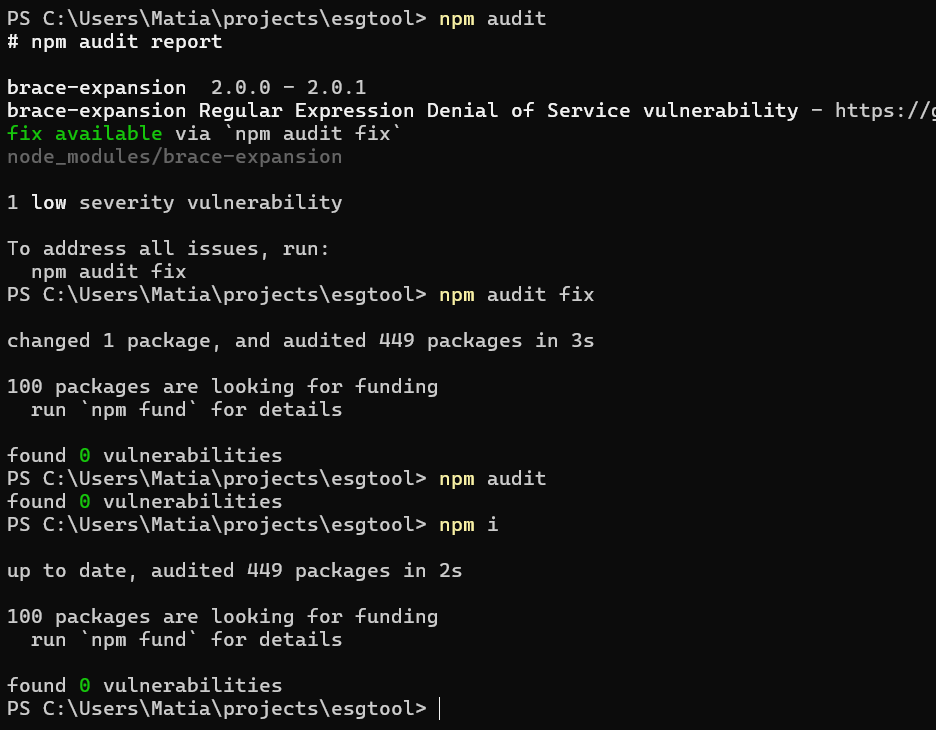
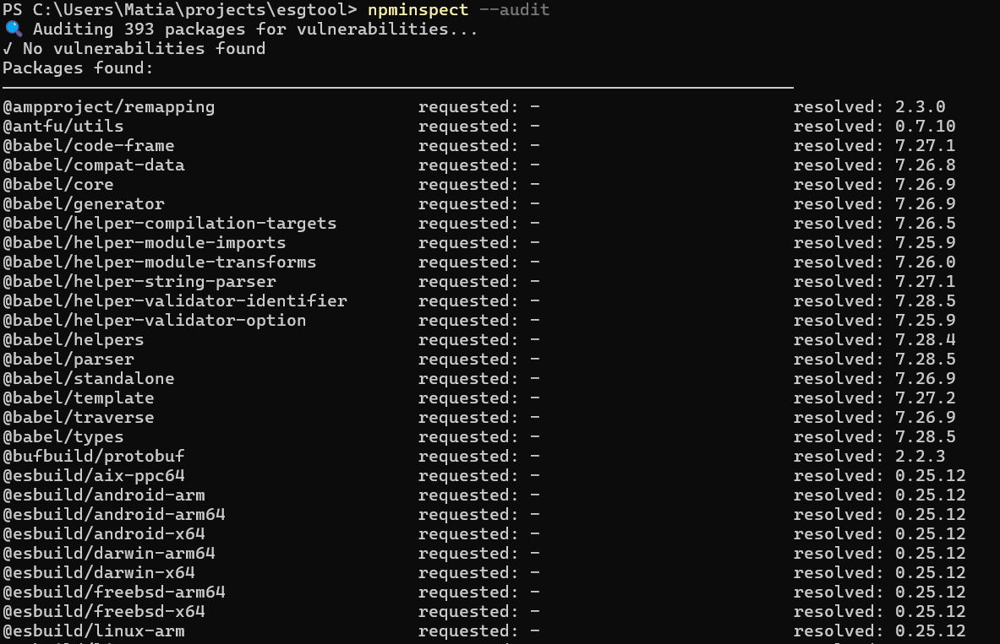
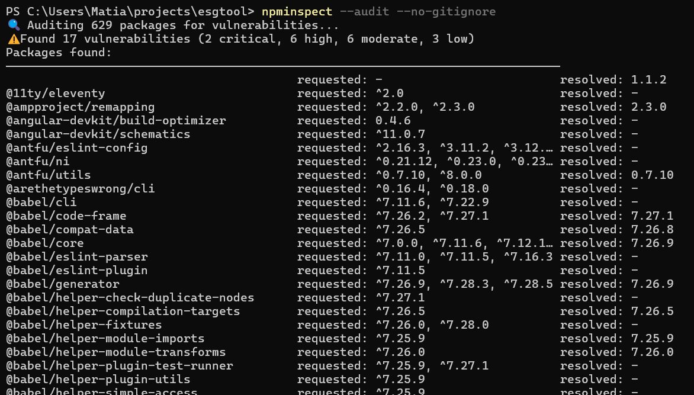

`npm audit` can't apparently find vulnerable packages from nested deps.

By allowing the `npminspect` to scan the node_modules folder recursively we can find plenty of high severity vulnerability packages listed in lock-files etc.  

By default the npminspect also scans the dev-deps but the results were the same with flag `--include-non-runtime false` with this particular project. 

Issue is that `npm audit fix` can not, atleast by default, detect the nested vulnerabilities and this could be one of the reasons that makes the npm ecosystem delicious ground for supply-chain attacks.